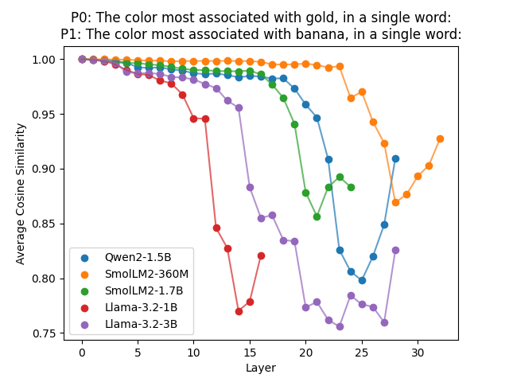

Script for comparing similarity of LLM hidden states between different prompts, across all layers.

Built on Transformers library, works with any model that has the same hidden state structure as LlamaForCausalLM (most models). Only intended for pretrained (not instruct) models.

Usage: `uv run prompt_hidden_similarity.py`

Example comparing hidden states for prompts P0 and P1:

Less similar prompts show less structured similarity:

![nosim][examples/nosim.png]

Note magnitude: the least similar that any model+layer gets on the same-structure prompts is about the most similar that any model+layer gets on the different-structure prompts.

What do all the squiggles mean? Why do most models have a "bounce" for the same-structure prompts? Why does the last layer increase similarity in one case but decreases it in the other? Who knows :)